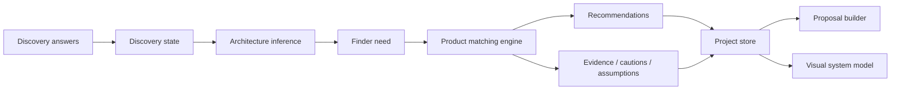
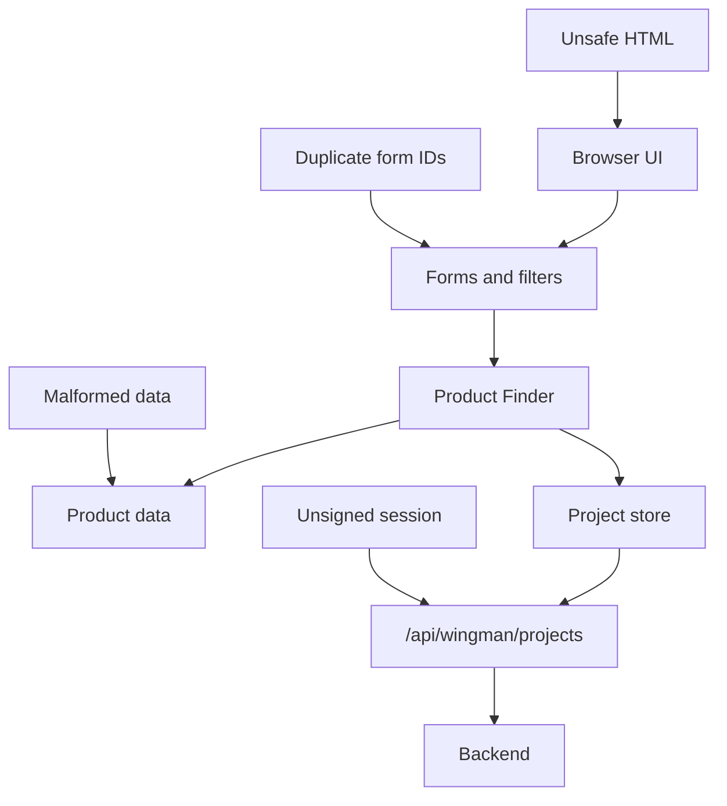
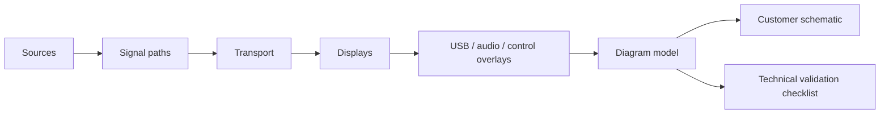

# Wingman stress test and visual model strategy

This document defines a repeatable stress/integrity test layer for Wingman. It checks product data quality, AV recommendation accuracy, frontend safety, project sync fallback behaviour, and readiness for visual system models.

## Discovery to recommendation data flow

## Technical stress surfaces

## Visual system model pipeline

## Known AV accuracy checks

The stress layer should flag:

- incorrect `MHD-0401-MV` references
- missing `NHD-0401-MV`
- missing `NHD-150-RX`
- missing `NHD-128-NDI-TRX`
- missing `SW-0204-VW`
- missing `SW-0206-VW`
- obvious scraped product-data noise
- unsafe frontend HTML patterns
- duplicate literal form field IDs
- missing local project-store fallback behaviour
